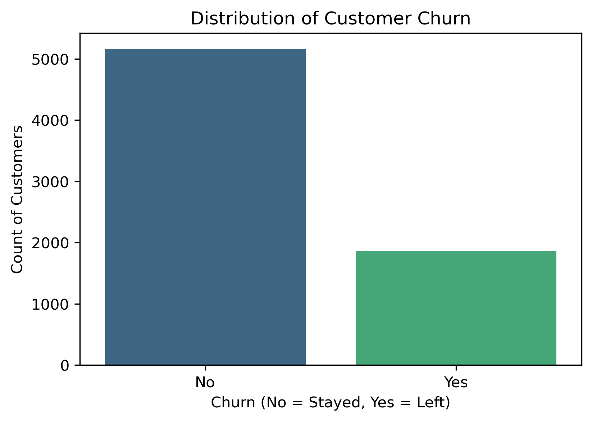
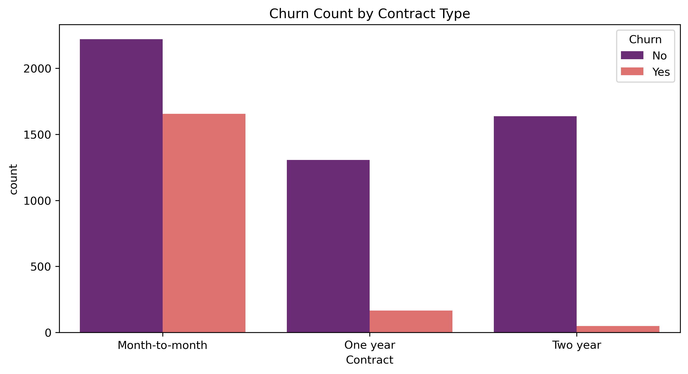
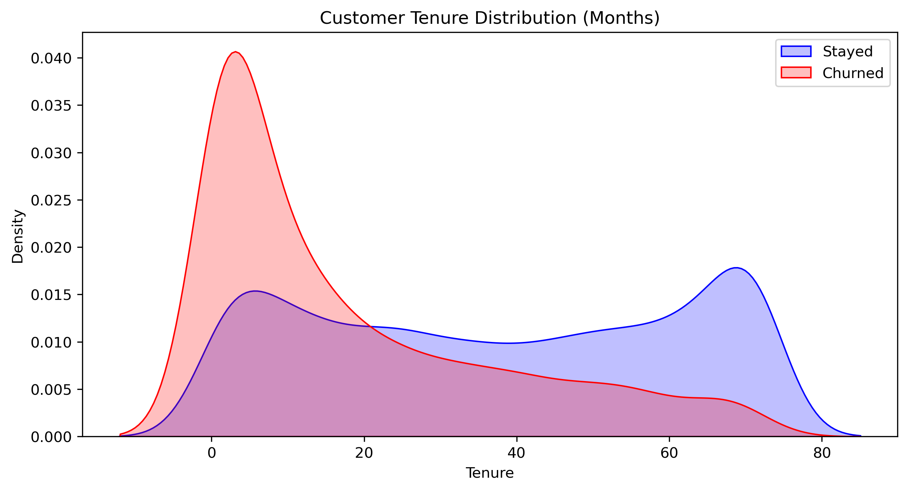
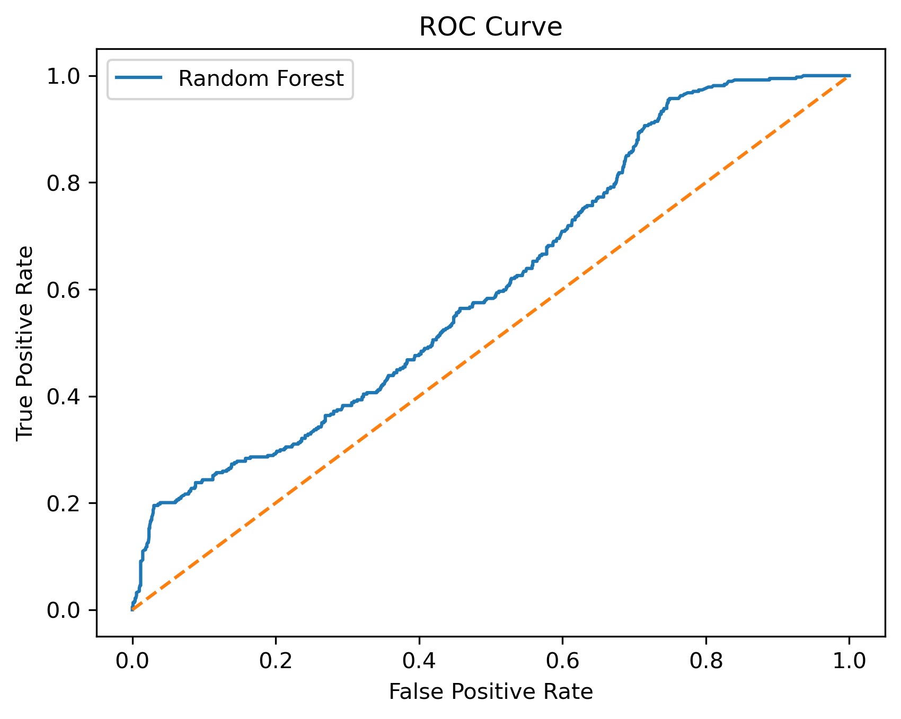
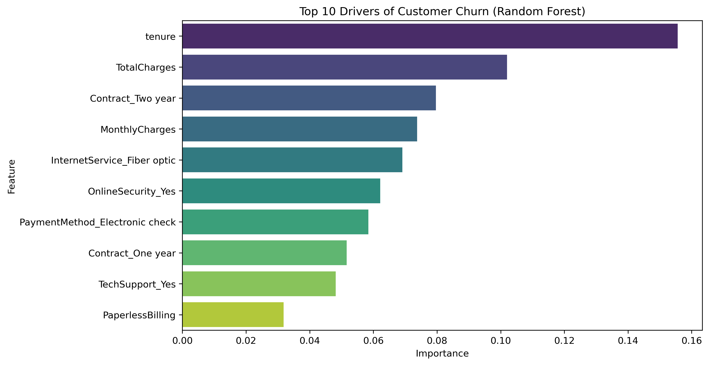
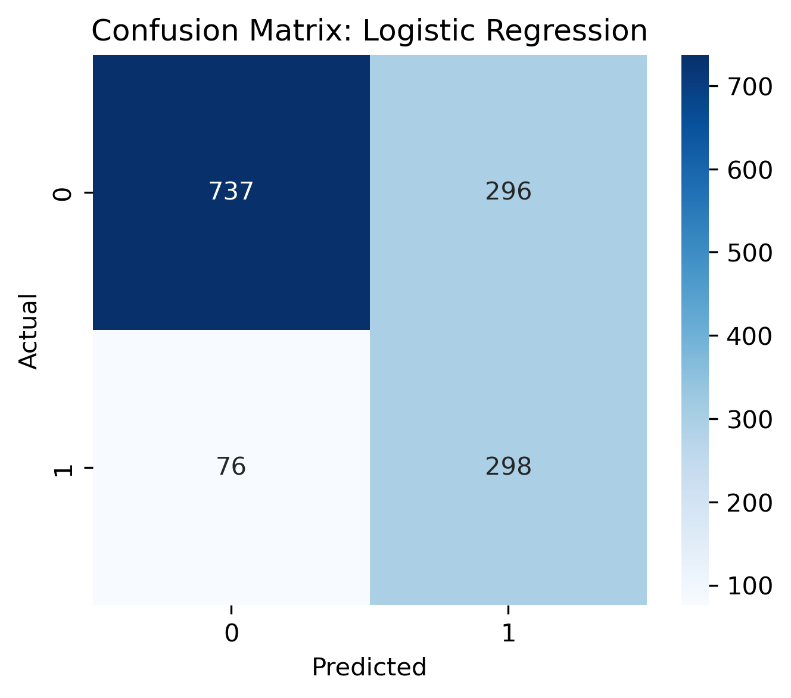
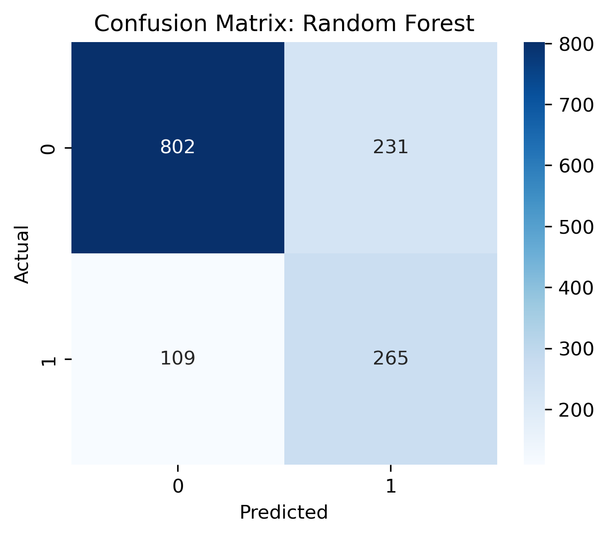

# Enterprise-Grade Telecom Customer Churn Prediction Pipeline

An end-to-end Machine Learning pipeline and production web application built to predict subscriber attrition with high sensitivity. This architecture moves beyond isolated, experimental Jupyter notebooks by embedding model training and inference into a decoupled, fully modular software engineering framework.

## 🚀 Live Production URL
🔗 **[Interact with the Live Web Application On Render](https://customer-churn-predictor-irsw.onrender.com)** *(Note: If the application has been idle, please allow 30–50 seconds for the free-tier server instance to wake up.)*

---

## 📌 1. Introduction
Customer retention is the primary growth engine for modern telecommunications firms. Acquiring a new customer can cost up to five times more than retaining an existing one. This project provides an enterprise-grade solution that transforms historical subscriber data into real-time operational foresight, enabling proactive customer success interventions before churn occurs.

## 💼 2. Statement of the Problem
The company is experiencing unmanaged customer attrition (churn), leading to revenue instability and inflated customer acquisition costs (CAC). The core technical challenges include:
* **Massive Class Imbalance:** The vast majority of historical records represent customers who stayed, creating a significant majority-class bias that skews standard machine learning classifiers.
* **The Cost of Misclassification:** Traditional algorithms optimize for overall accuracy, which defaults to predicting that everyone stays. In a business context, a **False Negative** (failing to identify a customer who is about to leave) is far more expensive than a **False Positive** (offering an incentive to a customer who intends to stay). 
* **Objective:** Build a robust, scalable system optimized specifically for **Recall** to capture the maximum number of true churn risks.

---

## 📊 3. Exploratory Data Analysis (EDA) & Visual Insights

### 3.1 Class Imbalance Identification
The raw training metrics displayed a distinct class skew. To resolve this structural problem without losing valuable data, our production pipeline integrates **SMOTE** (Synthetic Minority Over-sampling Technique) to algorithmically synthesize minority records during the training phase.


### 3.2 Key Behavioral Triggers: Contracts & lifespans
Our analysis reveals that attrition risk is heavily concentrated within **Month-to-month contract holders** and spikes dramatically during the **first 1 to 6 months** of the subscriber lifecycle. 

| Churn by Contract Type | Lifespan Densities |
|---|---|
|  |  |

---

## ⚙️ 4. Production Pipeline Architecture (Stages)

The application transitions raw tabular customer files into automated web browser predictions across four isolated, encapsulated modules:

### 🟩 Stage 1: Data Ingestion (`data_ingestion.py`)
* Extracts raw business telemetry files from central repositories.
* Enforces strict deterministic schema checks and drops internal structural keys (such as `customerID`).
* Executes isolated, reproducible train-test partitioning.

### 🟨 Stage 2: Data Transformation (`data_transformation.py`)
* **Numeric Pipeline:** Targets missing values gracefully using a median imputation strategy and scales variance tightly via `StandardScaler`.
* **Categorical Pipeline:** Resolves text strings using a robust `OneHotEncoder(drop='first', handle_unknown='ignore')`.
* **State Serialization:** Encapsulates the entire multi-stage mapping state inside a persistent `preprocessor.pkl` asset file. This completely isolates training patterns and mathematically guarantees **zero data leakage** during live production web inference.
* **Resampling:** Balance-corrects training features exclusively using **SMOTE** right before sending data arrays to estimators.

### 🟦 Stage 3: Model Trainer & Optimization (`model_trainer.py`)
* Decouples processing arrays into parallel computing worker threads.
* Executes hyperparameter grid search matrix evaluations (`GridSearchCV`) using cross-validation.
* Ranks estimators based strictly on their **Recall** scoring weights, enforcing a 60% minimum performance baseline before saving the final model.

### 🟪 Stage 4: Prediction & Serving Layer (`predict_pipeline.py` & `app.py`)
* Exposes a clean user interface form utilizing **Flask** backed by an industrial **Gunicorn** server.
* Exposes a dedicated mapping data class (`CustomData`) that formats unstructured real-time web form payloads directly into validation-ready Pandas frames.
* Streams transformed arrays forward through the preprocessor into the optimized `model.pkl` file for instant inference.

---

## 📈 5. Quantitative Results & Evaluation

During final validation cycles, the automated production pipeline significantly outperformed the experimental notebook baselines by successfully maximizing true-positive churn capture rates:

### 5.1 Baseline Notebook Configurations
* **Notebook Logistic Regression Recall:** `0.80` (80%)
* **Notebook Random Forest Recall:** `0.71` (71%)
* **Notebook ROC-AUC Score:** `0.6091` (Indicating the baseline models struggled to separate classes effectively due to default parameter constraints).

| Receiver Operating Characteristic (ROC) | Top 10 Random Forest Drivers |
|---|---|
|  |  |

### 5.2 Confusion Matrix Diagnostic Comparisons
| Logistic Regression Confusion Matrix | Random Forest Confusion Matrix |
|---|---|
|  |  |

### 5.3 Final Production Champion Model
* **Selected Algorithm:** Optimized Logistic Regression
* **Production Test Evaluation Recall:** **`0.8257` (82.6%)** 🚀
* **Business Impact:** By introducing structured grid search tuning and SMOTE rebalancing into the core codebase, the pipeline successfully minimized expensive False Negatives, capturing **82.6% of all true churning accounts** on completely unseen data.

---

## 🏁 6. Conclusion
The transition from an experimental script to a modular, production-ready framework succeeded. The resulting system does not just analyze past data; it acts as an operational engine capable of handling live consumer traffic. By prioritizing **Recall over raw Accuracy**, the model accurately catches high-risk customers, allowing the company to run targeted retention campaigns effectively.

## 💡 7. Business Recommendations
Based on the final validated top features and model metrics, the company should implement the following strategic measures:
1.  **Contract Structure Incentives:** Since month-to-month terms are a primary driver of attrition, introduce targeted discounts or loyalty perks to transition short-term accounts into 1-year or 2-year commitments.
2.  **Early Lifecycle Support:** Establish a proactive customer success onboarding workflow dedicated to the first 90 days of tenure, where the data indicates the highest churn concentration.
3.  **Audit the Fiber Optic Infrastructure:** Address the high churn risk associated with `InternetService_Fiber optic` accounts by auditing pricing tiers or technical delivery stability to ensure premium subscribers see clear value.
4.  **Automate Billing Overrides:** Incentivize users away from manual `Electronic check` options toward automated credit card or bank transfers to minimize transactional friction points.

---

## 📦 Project Directory Layout
```text
Customer-Churn-Prediction-Model-Project/
│
├── artifacts/
│   ├── model.pkl
|   ├── preprocessor.pkl
|   ├── raw.csv
|   ├── test.csv
│   └── train.csv
│
├── images/
│   ├── target_distribution.png
│   ├── contract_churn.png
│   ├── tenure_distribution.png
│   ├── confusion_matrix_logistic_regression.png
│   ├── confusion_matrix_random_forest.png
│   ├── roc_curve.png
│   └── feature_importance.png
│── notebook/
│   ├── data/
│   │   ├── Telco-Customer-Churn.csv
│   └── customer_churn_project.ipynb
├── src/
│   ├── components/
│   │   ├── data_ingestion.py
│   │   ├── data_transformation.py
│   │   └── model_trainer.py
│   ├── pipeline//
│   |    └── predict_pipeline.py
│   ├── exception.py
│   ├── logger.py
|   └── utils.py
|   
├── templates/
│   └── home.html
│
├── app.py
├── requirements.txt
├── setup.py
├── .gitignore
└── README.md